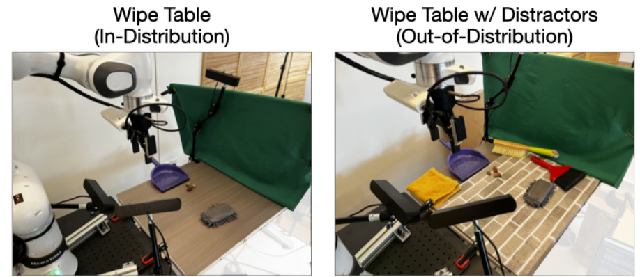
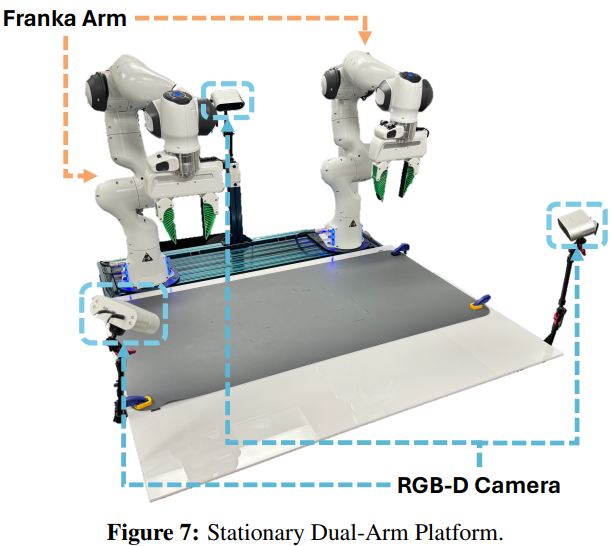
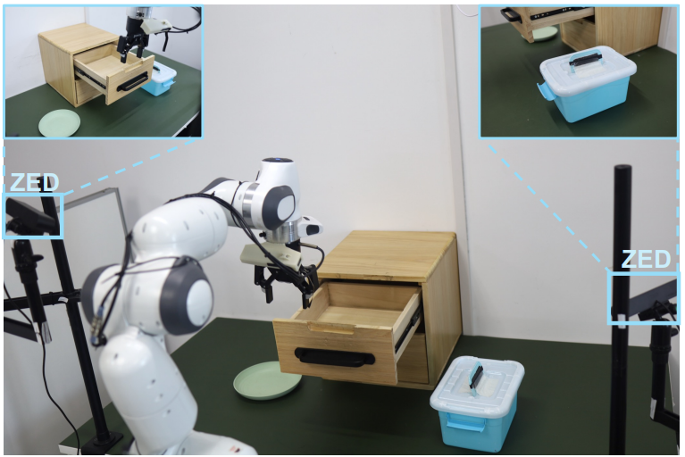
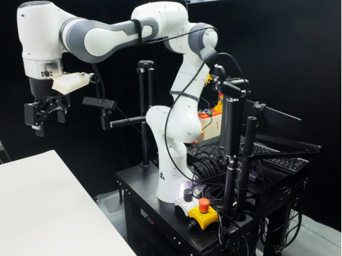
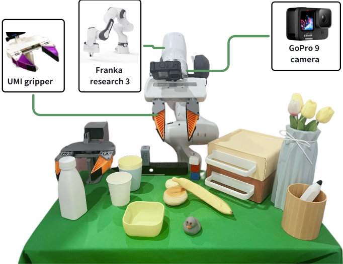
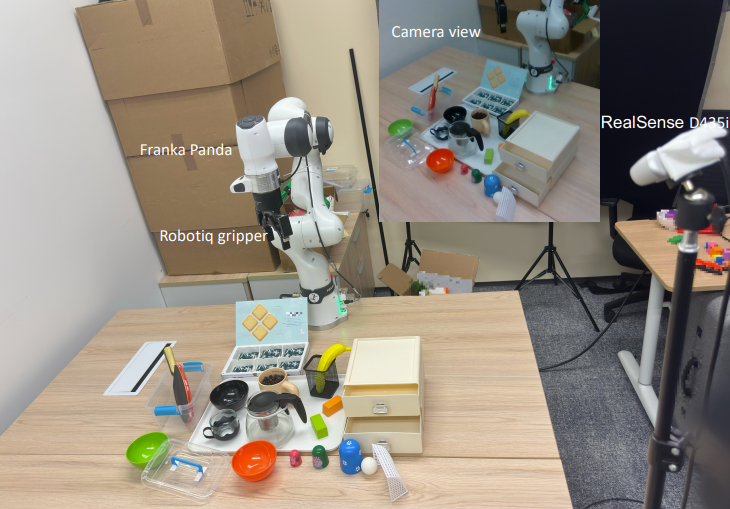
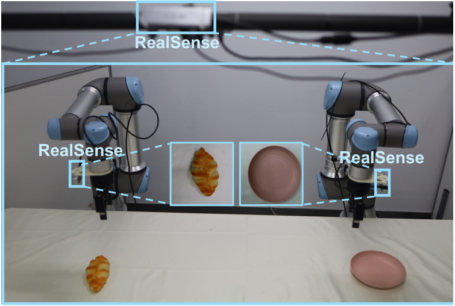
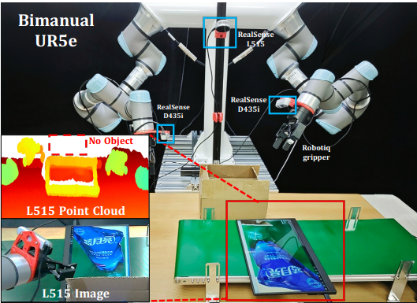
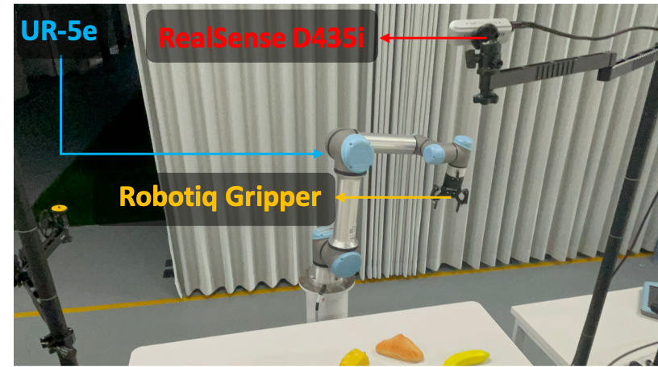

# Robotic-Arms

## Robotic Arm Setup Comparison

| Robot brand | Type | Price |
|-------------|-------------|-------|
| UR                  | UR5e    | 38,363 USD [[link]]([https://arxiv.org/pdf/2406.09246](https://vention.io/parts/universal-robots-ur5e-collaborative-robot-arm-2445utm_adgroupid=166917786371&utm_adid=696960133819&utm_device=c&utm_source=google&utm_medium=ppc&utm_campaign=21194967723&utm_term=&hsa_acc=6710393722&hsa_cam=21194967723&hsa_grp=166917786371&hsa_ad=696960133819&hsa_src=g&sa_tgt=pla-2557207605352&hsa_kw=&hsa_mt=&hsa_net=adwords&hsa_ver=3&gad_source=1&gad_campaignid=21194967723&gbraid=0AAAAADdnWDklI5YcUwBu2FuiRhBU-5Bt1&gclid=CjwKCAjw89jGBhB0EiwA2o1OniRLX93sPQsxZOWjrgCLCjPnedMKJIFXUWKQ8vagb4MT7Rj4DP5ThoC8UIQAvD_BwE))   |

| Paper Title | Robot Brand | Image |
|-------------|-------------|-------|
| OpenVLA [[link]](https://arxiv.org/pdf/2406.09246)                  | Franka    |   |
| ReKep [[link]](https://arxiv.org/pdf/2409.01652)                    | Franka    |   |
| RoboMIND [[link]](https://x-humanoid-robomind.github.io/)           | Franka    |   |
| TinyVLA [[link]](https://tiny-vla.github.io/)                       | Franka    |   |
| ObjectVLA [[link]](https://arxiv.org/pdf/2502.19250v2)              | Franka    |   |
| 3D Diffusion Policy [[link]](https://arxiv.org/pdf/2403.03954)      | Franka    |   |
| MoLe-VLA [[link]](https://arxiv.org/pdf/2503.20384v1)               | Franka    |   |
| Dita [[link]](https://arxiv.org/pdf/2503.19757v1)                   | Franka    |   |
| TinyVLA [[link]](https://tiny-vla.github.io/)                       | UR5e       |   |
| PointVLA [[link]](https://arxiv.org/pdf/2503.07511v1)               | UR5e      |   |
| RoboMIND [[link]](https://x-humanoid-robomind.github.io/)           | UR5e       |   |
